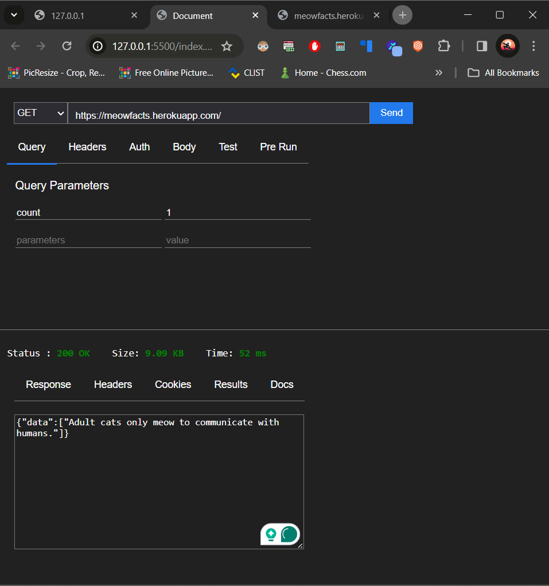
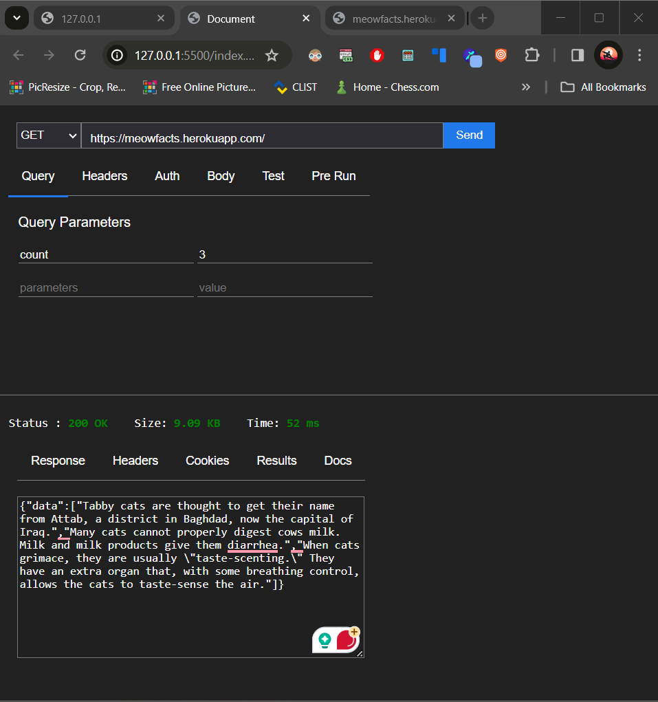

# Thunder Client Clone

This project is a basic Thunder Client clone, providing a simplified interface for making GET requests to HTTP APIs.

## Features

- Input field to enter the URL of the API endpoint.
- Dropdown menu to select the GET request method.
- Display of response status, size, and time after sending the request.

## Getting Started

1. Clone the repository to your local machine: https://github.com/Sumit4482/20240219_thunderclient_clone

2. Open the `index.html` file in your web browser to launch the application.

## Usage

1. Enter the URL of the API endpoint in the provided input field.
2. Select the GET request method from the dropdown menu.
3. Click the "Send" button to initiate the request.
4. View the response status, size, and time in the response section.

## Screenshots

<table>
  <tr>
    <td style="padding: 5px;">
      
    </td>
    <td style="padding: 5px;">
      
    </td>
  </tr>
</table
